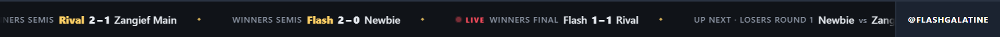

# Zipper — tournament ticker for Streamer.bot

A scrolling ticker strip for OBS that shows **live results of an ongoing
tournament** — completed sets, matches in progress, and what's up next —
polled straight from the bracket site. Named after the Times Square news
"zipper."



- **Platforms:** Challonge and start.gg today (API or keyless), Matcherino
  standings; Round.one and TourneyBot planned.
- **Any width:** 1920px broadcast strip by default, `?w=640` for old-school
  layouts — one overlay file.
- **End caps:** optional static logo (left) and streamer-set text like a social
  handle (right); the middle scrolls.
- **Top-N focus:** optionally show only matches involving the top-N placed
  participants (e.g. Top 4) — uses the platform's standings (start.gg always;
  Challonge via `final_rank` on your own keyed tournaments, or derived from the
  elimination order once a scraped bracket finishes).
- **Announcements:** subs, raids, milestones, or anything you type interrupt
  the crawl — the strip pauses, shows the alert with a kind pill, and resumes.
  Wire SB's own Twitch triggers to the `Ticker Announce` action for sub/raid
  alerts; milestone announcements poll StreamElements (JWT in `config.json`).
- **Streamer.bot-native:** three SB actions + a small Node sidecar. Overlays
  reconnect and repaint by themselves; last results survive an SB restart.

```
bracket site ──poll── zipper-sidecar.mjs ──DoAction──▶ Streamer.bot ──broadcast──▶ OBS overlay(s)
                             ▲                                                       + control page
                             └──────────── ticker:command (control page) ◀───────────┘
```

## Setup

Requires Node ≥ 18, Streamer.bot ≥ 1.0.4 with its **WebSocket Server** enabled
on `:8080` (authentication OFF) and its **HTTP Server** on `:7474`.

### 1. Streamer.bot actions

Create these actions — names must match exactly:

| Action name      | Sub-action | Paste |
|------------------|-----------|-------|
| `Ticker Push`    | Core → C# → Execute C# Code | [`actions/ticker-push.cs`](actions/ticker-push.cs) |
| `Ticker Command` | Core → C# → Execute C# Code | [`actions/ticker-command.cs`](actions/ticker-command.cs) |
| `Ticker Announce` | Core → C# → Execute C# Code | [`actions/ticker-announce.cs`](actions/ticker-announce.cs) |
| `Ticker Sidecar Start` *(optional)* | Core → C# → Execute C# Code | [`actions/ticker-sidecar-start.cs`](actions/ticker-sidecar-start.cs) |

Click **Compile** on each — all must report success. `Ticker Sidecar Start`
also needs `System.dll` added on its References tab (see the file's header);
edit its `BUNDLE` path and add SB's application-started trigger to auto-launch
the sidecar with Streamer.bot.

### 2. HTTP maps

Streamer.bot → Servers/Clients → HTTP Server → add two Path→Folder maps
(the `zipper-` prefixes avoid collisions with other components):

| Path | Folder |
|------|--------|
| `zipper-overlay` | `<this repo>\overlay` |
| `zipper-shared`  | `<this repo>\zipper-shared` |

### 3. OBS source

Add a Browser Source:

```
http://127.0.0.1:7474/zipper-overlay/ticker.html?w=1920&h=72
```

Set the OBS source size to match: `?w=` width (default 1920), `?h=` height
(default 72). Use the http URL, not a local file — OBS `file://` sources ignore
`?w=`/`?h=` and friends.

### 4. Sidecar

```
npm install
start-zipper.bat        (or: npm run sidecar)
```

**The sidecar must be running** — it's what turns control-page clicks into
polls and pushes. If it isn't up, the control page shows a red banner and the
Start / Poll / Stop / end-cap buttons do nothing (announcements still work, as
those go Streamer.bot → overlay without the sidecar). The `Ticker Sidecar
Start` action above lets Streamer.bot launch it for you.

Copy `config.example.json` → `config.json` for API keys (optional but
recommended: `challongeApiKey`, `startggApiKey` — without them Zipper falls
back to each site's public/keyless surface, which can be less reliable).

### 5. Drive it

Open the control page — in a browser or as an OBS custom dock:

```
http://127.0.0.1:7474/zipper-shared/control.html
```

Paste the tournament URL (e.g. `https://challonge.com/blko42` or
`https://www.start.gg/tournament/…/event/…`), **Set**, **Start polling**. Set
the end-cap text/logo there too. Chat control also works — point a `!ticker`
command trigger at the `Ticker Command` action and type
`!ticker setUrl https://…`, `!ticker setTopN 4`, `!ticker stop`, etc.

### 6. Announcements (optional)

- **Sub/raid alerts:** in Streamer.bot, add the `Ticker Announce` action to
  your Subscription / Gift Sub / Raid triggers — it auto-composes the text from
  the trigger arguments ("UserName is raiding with 25 viewers!"), or pass an
  explicit `text` argument to customize.
- **Milestones:** put your StreamElements JWT in `config.json`
  (streamelements.com → account → Channel settings → Show secrets) and set step
  sizes, e.g. `"milestones": { "followers": 100, "subs": 25 }` — the ticker
  announces every time a counter crosses a step. The token stays in the file;
  it is never broadcast.
- **Manual:** the control page's Announcement box sends anything you type.

## Platform notes

| Platform | Status | Path |
|----------|--------|------|
| Challonge | ✅ | API (`challongeApiKey`; your own tournaments only — others 404 and auto-fall back) or keyless bracket-embed scrape |
| start.gg | ✅ | API (`startggApiKey`) or keyless public gql proxy¹ |
| Matcherino | ✅ standings-only | public JSON endpoint (no per-match data) |
| Round.one | 🔜 planned | public tournament JSON — match shape research pending |
| TourneyBot | 🔜 planned | `__NEXT_DATA__` scrape — match shape research pending |

¹ The keyless start.gg proxy may reject the sets query; if it 400s, add an API
key (start.gg → developer settings).

## Dev & tests

```
npm start               # mock Streamer.bot (:7474/:8080) + sample data at /mock/fixture
npm run verify          # 65 checks: normalizer fixtures, panel-core, sidecar E2E — no network
npm run verify:render   # real-pixel screenshots at 1920/640 (npm i --no-save playwright-core)
npm run shots           # regenerate docs/ screenshots
```

Docs: [wire protocol](docs/PROTOCOL.md) · [theming](docs/THEMING.md)

## Author & support

Built by **Ashe "Flash" Galatine**.

- Email — [AsheJunius@gmail.com](mailto:AsheJunius@gmail.com)
- X — [@AsheJunius](https://x.com/AsheJunius) · BlueSky — [@projectgalatine.com](https://bsky.app/profile/projectgalatine.com)
- Twitch — [FlashGalatine](https://www.twitch.tv/FlashGalatine) · Discord — [Newbie Fight Club](https://discord.gg/NewbieFightClub)
- Support — Patreon [ProjectGalatine](https://www.patreon.com/ProjectGalatine) · CashApp [$ProjectGalatine](https://cash.app/$ProjectGalatine)

## Credits & license

MIT — see [LICENSE](LICENSE). The tournament platform matchers/scrapers are
adapted from the roster importer in [StreamScoreboard](https://github.com/FlashGalatine)
(same author, MIT), extended here to read live match results. Sole runtime
dependency is [ws](https://github.com/websockets/ws) (MIT). See
[THIRD_PARTY_NOTICES.md](THIRD_PARTY_NOTICES.md).
